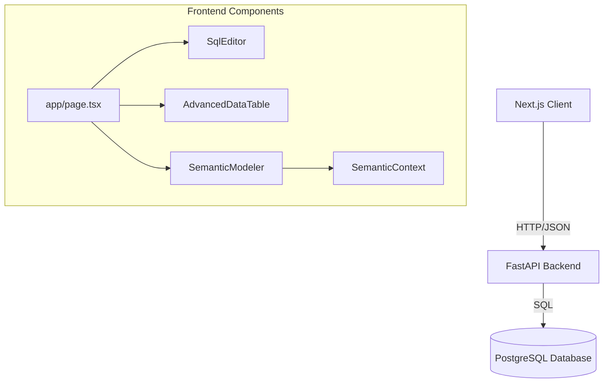

# Project Design: IPL Table Analytics Platform

## 1. Overview

The IPL Table Analytics Platform is a modern, web-based application designed for interactive data exploration, SQL analysis, and semantic modeling of IPL (Indian Premier League) match data. It provides a unified interface for data engineers and analysts to query raw data, define semantic relationships, and visualize results.

## 2. Architecture

### 2.1 Technology Stack

- **Frontend**: Next.js 16 (App Router), React 19, TypeScript
- **Styling**: Tailwind CSS v4, Shadcn/UI, Lucide React
- **State Management**: React Context (`SemanticContext`), React Hooks
- **Editor**: Monaco Editor (`@monaco-editor/react`)
- **Drag & Drop**: `dnd-kit`
- **Visualizations**: `recharts` (implied for Analysis tab)
- **Backend**: FastAPI (Python) running on port 8000

### 2.2 System Diagram

## 3. Core Modules

### 3.1 Main Shell (`app/page.tsx`)

The application is structured as a single-page application (SPA) with four primary modes:

1.  **Semantic Modeling**: Visual interface for defining relationships between tables.
2.  **Data**: Tabular view of datasets with advanced filtering.
3.  **SQL Editor**: IDE-like environment for writing and executing raw SQL.
4.  **Analysis**: Visualization dashboard (Placeholder/In-progress).

**Key Responsibilities:**

- Global Navigation (Toolbar)
- Global State (Current Dataset, View Mode)
- Global Tools (Filter Popover, AI Chat Toggle)

### 3.2 SQL Workspace (`SqlEditor.tsx`)

A full-featured SQL IDE embedded in the browser.

- **Schema Explorer**: Tree view of database objects (Schemas, Tables, Columns).
- **Query Editor**: Monaco-based editor with syntax highlighting and auto-completion.
- **Result Management**: Support for multiple query tabs, each with its own result history.
- **Execution**: Connects to `POST /query` to execute SQL and retrieve paginated results.

### 3.3 Semantic Layerr (`components/semantic/`)

Allows users to model business logic on top of raw physical tables.

- **SemanticModeler**: The main container using `react-resizable-panels`.
- **DatabaseExplorer**: Drag-and-drop source list of physical tables.
- **SemanticCanvas**: Interactive canvas where tables are dropped and joined.
- **PropertiesPanel**: Configuration panel for defining column semantics (Dimensions, Metrics).
- **Context**: `SemanticContext` manages the state of the semantic graph (Tables, Joins, Mappings).

### 3.4 Data Table (`components/ui/advanced-data-table`)

A reusable, robust data grid component used across the application to display query results and dataset previews. Features likely include pagination, sorting, and cell formatting.

## 4. Design Patterns & Best Practices

- **Component Composition**: Complex UIs are built from smaller, reusable Shadcn primitives (`Dialog`, `Popover`, `Button`).
- **Optimistic UI**: The Semantic Modeler likely employs optimistic updates for drag-and-drop operations to ensure fluidity.
- **Context-Based State**: Global semantic state is hoisted to `SemanticContext` to avoid prop drilling between the Explorer, Canvas, and Properties Panel.
- **Lazy Loading**: The Schema Explorer in `SqlEditor` uses on-demand fetching for schemas and tables to handle large databases efficiently.

## 5. API Integration Strategy

The frontend interacts with the backend via a RESTful API structure:

- **Metadata**: `GET /metadata/*` (Schemas, Tables, Columns)
- **Querying**: `POST /query` (Raw SQL execution)
- **Datasets (Semantic)**:
  - `GET/POST /datasets` (Manage logical datasets)
  - `POST /datasets/{id}/tables` (Add table to canvas)
  - `POST /datasets/{id}/joins` (Define relationships)
  - `POST /datasets/{id}/columns` (Configure column properties)

## 6. Future Considerations

- **Authentication**: Currently open/dev mode. Needs user auth.
- **Backend Validation**: Ensure all semantic operations are validated against the physical schema.
- **Visual Analysis**: Building out the "Analysis" tab with drag-and-drop chart builders using `recharts`.
